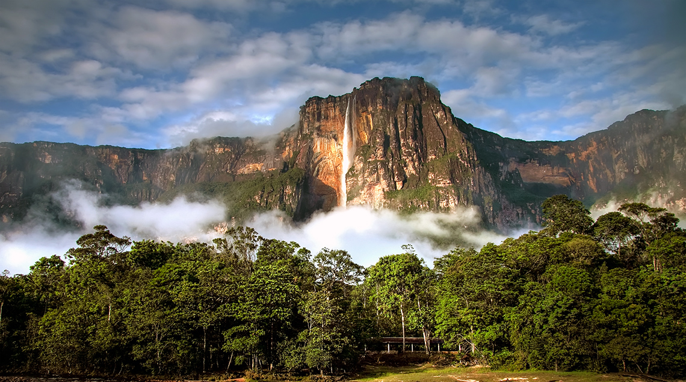

# Анхель

Анхель, Керепакупаи-Меру (исп. Kerepakupai Meru[1], исп. Salto Ángel, на пемонском языке — Kerepakupai vena, что значит «Водопад глубочайшего места») — самый высокий водопад в мире, общая высота 979 метров (по другим данным 1054[2] метра), высота непрерывного свободного падения воды 807[3] метров. Находится на реке Кереп в венесуэльском штате Боливар.
## Описание
Назван в честь лётчика Джеймса Эйнджела (англ. Angel), который пролетел над водопадом в 1933 году.
Водопад находится в тропических лесах венесуэльского штата Боливар, на территории национального парка Канайма. Вода свергается с вершины Ауян-Тепуи, крупнейшей из венесуэльских тепуи — его название в переводе на русский означает «гора дьявола»[4]. Высота падения настолько велика, что, прежде чем достичь земли, вода распыляется на мельчайшие частички и превращается в туман. Туман может ощущаться за несколько километров. Падающая вода попадает в реку Кереп.
## Туризм
Водопад Анхель расположен в дикой местности Венесуэлы, и добраться туда можно только по воздуху или по реке[6]. Туры на водопад продаются комплектами и включают в себя полёт из Каракаса или Сьюдад-Боливар в Канайму (поселок, служащий точкой входа в национальный парк), последующую поездку по воде, еду и прочие вещи, необходимые для посещения водопада.

**ссылка на информацию** [здесь](https://ru.wikipedia.org/wiki/%D0%90%D0%BD%D1%85%D0%B5%D0%BB%D1%8C)
sdgdsfg
dsfh
sdfh
df
sh